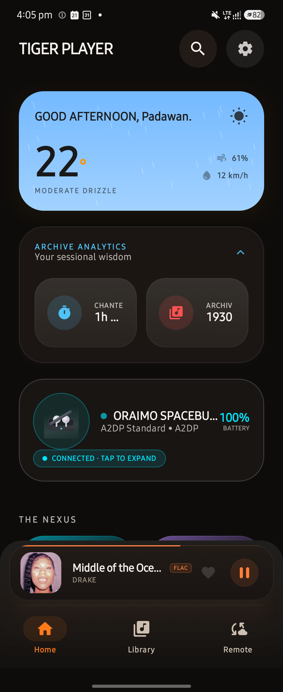
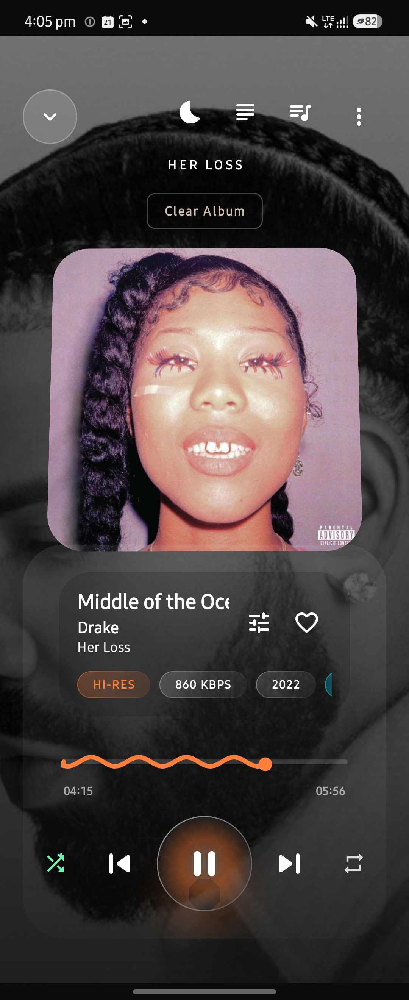
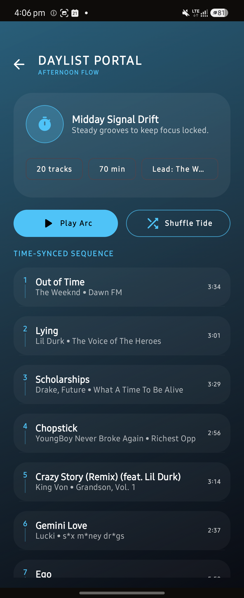
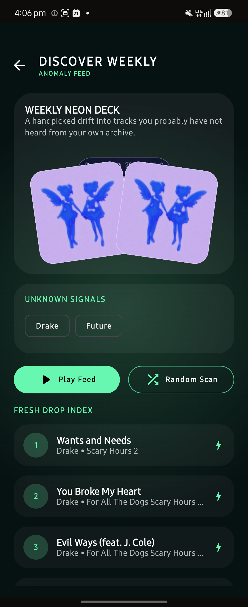
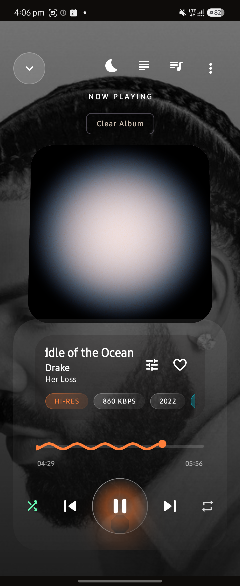
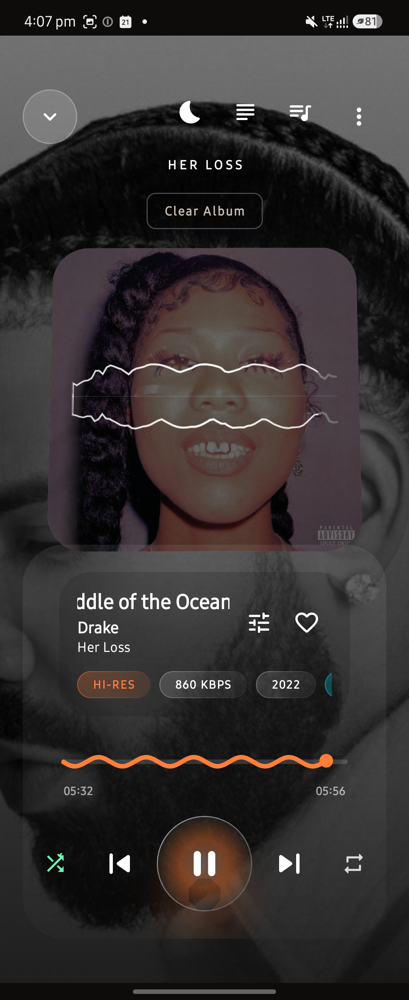

# TigerPlayer 🐅🐺

### v2.0 "NEON VANGUARD"

A modern Android music player that combines **local audio playback**, **Spotify integration**, **smart music discovery**, and a **real-time GPU-powered visualizer** into a single experience.

Built with **Kotlin**, **Jetpack Compose**, **AndroidX Media3**, **Room**, and **OpenGL ES**.

---

## ✨ Highlights

- 🎵 Local music playback with Media3 / ExoPlayer
- 🎧 Spotify App Remote integration
- 🧠 On-device music discovery and listening analytics
- 🌊 Real-time fluid visualizer with audio-reactive effects
- ⚡ Jetpack Compose UI with a custom neon design system
- 💾 Room-powered library, history, and analytics storage
- 🔒 Spotify Authorization Code + PKCE authentication

---

## 📸 Screenshots

| Home                          | Player                            | Day List                             |
|-------------------------------|-----------------------------------|--------------------------------------|
|  |  |  |

| Discover Weekly                                     | Fluid Visualizer                                     | Waveform Visualizer                                         |
|-----------------------------------------------------|------------------------------------------------------|-------------------------------------------------------------|
|  |  |  |

---

## 🚀 Key Features

### Dual Playback Engine

TigerPlayer unifies:

- Local music playback via Media3
- Spotify playback via Spotify App Remote
- Shared controls, queue management, and playback state

### Smart Discovery

Personalised recommendations generated entirely on-device.

- **Day List** based on listening habits and time of day
- **Discovery Weekly** for resurfacing forgotten tracks
- **Heavy Rotation** tracking
- **Sonic Footprint** listening analytics

### Fluid Visualizer

A custom GPU-based visualizer featuring:

- Audio-reactive fluid simulations
- Dynamic colour extraction
- Bloom effects
- ACES tone mapping
- Real-time shader rendering

---

## 🏗️ Architecture

TigerPlayer follows **Clean MVVM** with **Unidirectional Data Flow (UDF)** powered by Kotlin Coroutines and StateFlow.

```text
UI (Jetpack Compose)
        │
        ▼
Domain / Engine Layer
        │
        ▼
Data Layer
 ├── Media3
 ├── Spotify Remote
 ├── Room
 ├── DataStore
 └── Remote APIs
```

---

## 🛠 Tech Stack

| Component    | Technology                  |
|--------------|-----------------------------|
| Language     | Kotlin 2.x                  |
| UI           | Jetpack Compose             |
| Audio        | AndroidX Media3 / ExoPlayer |
| Database     | Room                        |
| Preferences  | DataStore                   |
| Networking   | Retrofit                    |
| Architecture | MVVM + UDF                  |
| Visualizer   | OpenGL ES 3.0+              |
| JDK          | 17                          |

---

## 🔑 Setup

TigerPlayer ships two build flavors:

- **`foss`** — no vendored proprietary binaries, no Spotify App Remote dependency, builds and
  runs with zero API keys. This is the flavor submitted to F-Droid.
- **`full`** — the current feature set, including Spotify App Remote playback.

Create a `secrets.properties` file in the project root if you want Spotify / Last.fm / YouTube
features (optional — the build succeeds without it, those features are simply disabled):

```properties
SPOTIFY_CLIENT_ID=your_spotify_client_id
LASTFM_API_KEY=your_lastfm_api_key
YOUTUBE_API_KEY=your_youtube_api_key
```

> Spotify authentication uses Authorization Code with PKCE. No Spotify client secret is required.

---

## 🎧 Spotify Configuration

1. Create an app in the Spotify Developer Dashboard.
2. Use package name:

```text
com.example.tigerplayer
```

3. Add your signing SHA-1 fingerprints.
4. Register:

```text
tigerplayer://callback
```

---

## 🔨 Build

FOSS build (no API keys, no proprietary AAR — this is what F-Droid builds):

```bash
./gradlew :app:assembleFossDebug
```

Full build (includes Spotify App Remote):

```bash
./gradlew :app:assembleFullDebug
```

Release build:

```bash
./gradlew :app:assembleFossRelease
```

Run tests:

```bash
./gradlew :app:testFossDebugUnitTest
```

Run lint:

```bash
./gradlew :app:lintFossDebug
```

---

## 📂 Project Structure

```text
app/
├── data/          # Database, repositories, APIs
├── engine/        # Playback, DSP, visualizer engines
├── navigation/    # Navigation graph
├── service/       # Media services
└── ui/            # Compose screens and components

docs/              # Documentation
```

---

## 🤝 Contributing

Contributions are welcome.

Before submitting a PR:

1. Open or link an issue.
2. Keep changes focused and scoped.
3. Run tests and lint checks.
4. Update documentation when needed.

---

## ❤️ Credits

Created by **Jaedon** in Nairobi, Kenya.

TigerPlayer is an ongoing exploration of high-fidelity Android audio, intelligent music discovery, modern UI design, and real-time graphics.
